# ERP Gudang Sembako Grosir — Sinar Wardana

Aplikasi ERP berbasis web untuk mengelola seluruh operasional distributor sembako grosir: pembelian, stok, penjualan, distribusi, sales, pelanggan, piutang, dan laporan. Termasuk **Portal Pelanggan** untuk order online.

> [!IMPORTANT]
> Proyek ini sangat besar (19 tahap). Saya akan membangunnya secara bertahap. Setiap tahap menghasilkan kode yang lengkap dan dapat langsung dijalankan.

---

## User Review Required

> [!WARNING]
> **Nama Aplikasi**: Saya menggunakan "**Sinar Wardana**" sebagai nama perusahaan/aplikasi. Apakah ini sudah benar?

> [!IMPORTANT]
> **Database**: Apakah Anda sudah memiliki MySQL/MariaDB terinstall di komputer? Jika belum, saya perlu instruksi setup.

> [!IMPORTANT]
> **PHP & Composer**: Apakah PHP 8.3+ dan Composer sudah terinstall? Saya perlu memastikan environment siap sebelum setup Laravel.

---

## Open Questions

> [!IMPORTANT]
> 1. **Nama database yang diinginkan?** Saya akan menggunakan `sinar_wardana_erp` jika tidak ada preferensi lain.
> 2. **Apakah ada logo perusahaan?** Jika ada, tolong letakkan di folder project. Jika tidak, saya akan generate placeholder.
> 3. **Mata uang**: Apakah semuanya menggunakan Rupiah (IDR)?
> 4. **Format nomor invoice/PO**: Apakah ada format khusus? Contoh: `INV/2026/08/0001` atau `PO-20260806-001`?
> 5. **Multi-tenant atau single-tenant?** Apakah aplikasi ini hanya untuk 1 perusahaan saja?

---

## Tech Stack Summary

| Layer | Technology |
|---|---|
| Backend | Laravel 12, PHP 8.3+ |
| Frontend | Livewire 3, AlpineJS, TailwindCSS |
| Auth | Laravel Breeze, Sanctum |
| Database | MySQL/MariaDB |
| Permissions | Spatie Permission |
| Export | Laravel Excel, DomPDF |
| Queue | Laravel Queue |
| Charts | Chart.js |
| Alerts | SweetAlert2 |
| GPS | HTML5 Geolocation API |
| API | REST API + Laravel Sanctum |

---

## Arsitektur Folder (Clean Architecture)

```
app/
├── Actions/           # Business logic actions (single responsibility)
├── Enums/             # Status enums (OrderStatus, PaymentStatus, dll)
├── Events/            # Domain events
├── Http/
│   ├── Controllers/
│   │   ├── Api/       # REST API Controllers
│   │   └── Web/       # Web Controllers
│   ├── Middleware/
│   └── Requests/      # Form Request Validation
├── Jobs/              # Queue jobs
├── Listeners/         # Event listeners
├── Models/            # Eloquent Models
├── Observers/         # Model observers (audit, stock tracking)
├── Policies/          # Authorization policies
├── Repositories/      # Data access layer
│   └── Interfaces/
├── Services/          # Business service layer
└── Traits/            # Reusable traits

resources/
├── views/
│   ├── components/    # Blade components
│   ├── layouts/       # App & portal layouts
│   ├── livewire/      # Livewire components
│   ├── pages/         # Page views
│   └── portal/        # Customer portal views
├── css/
└── js/

database/
├── factories/
├── migrations/
└── seeders/

routes/
├── web.php
├── api.php
└── channels.php
```

---

## ERD — Entity Relationship Diagram

```mermaid
erDiagram
    users ||--o{ role_user : has
    roles ||--o{ role_user : has
    users ||--o{ activity_logs : creates
    
    %% Master Data
    categories ||--o{ products : contains
    suppliers ||--o{ products : supplies
    suppliers ||--o{ purchase_orders : receives
    warehouses ||--o{ product_warehouse : stores
    products ||--o{ product_warehouse : stored_in
    products ||--o{ product_prices : has
    products ||--o{ product_images : has
    
    %% Purchasing
    purchase_orders ||--o{ purchase_order_items : contains
    purchase_orders ||--o{ goods_receipts : generates
    goods_receipts ||--o{ goods_receipt_items : contains
    purchase_orders ||--o{ supplier_returns : generates
    supplier_returns ||--o{ supplier_return_items : contains
    
    %% Stock
    products ||--o{ stock_movements : tracks
    warehouses ||--o{ stock_movements : in
    products ||--o{ stock_batches : has
    stock_opnames ||--o{ stock_opname_items : contains
    stock_mutations ||--o{ stock_mutation_items : contains
    
    %% Sales
    customers ||--o{ sales_orders : places
    sales_persons ||--o{ sales_orders : handles
    sales_orders ||--o{ sales_order_items : contains
    sales_orders ||--o{ invoices : generates
    invoices ||--o{ invoice_items : contains
    sales_orders ||--o{ deliveries : ships
    deliveries ||--o{ delivery_items : contains
    sales_orders ||--o{ sales_returns : returns
    sales_returns ||--o{ sales_return_items : contains
    
    %% Delivery
    drivers ||--o{ deliveries : drives
    vehicles ||--o{ deliveries : uses
    
    %% Sales Force
    sales_persons ||--o{ customers : manages
    sales_persons ||--o{ sales_visits : makes
    sales_persons ||--o{ sales_targets : has
    sales_persons ||--o{ sales_commissions : earns
    
    %% Finance
    customers ||--o{ receivables : owes
    receivables ||--o{ payments : receives
    suppliers ||--o{ payables : owed
    payables ||--o{ payment_outs : pays
    
    %% Portal
    customers ||--o{ online_orders : places
    online_orders ||--o{ online_order_items : contains
    
    %% Promo
    promos ||--o{ promo_products : includes
```



---

## Database Tables Detail

### Core / Auth
| Table | Keterangan |
|---|---|
| `users` | User login (semua role) |
| `roles` | Spatie roles |
| `permissions` | Spatie permissions |
| `model_has_roles` | Pivot user-role |
| `model_has_permissions` | Pivot user-permission |

### Master Data
| Table | Field Utama |
|---|---|
| `categories` | id, name, slug, description, status, sort_order |
| `suppliers` | id, name, pic, phone, email, npwp, address, city, status |
| `warehouses` | id, name, code, type (utama/transit/cabang), address, status |
| `products` | id, barcode, sku, name, brand, category_id, supplier_id, unit, weight, content_per_unit, min_purchase, base_cost, sell_price, distributor_price, agent_price, store_price, min_stock, status |
| `product_images` | id, product_id, image_path, is_primary, sort_order |
| `product_prices` | id, product_id, price_type (retail/agen/distributor), min_qty, max_qty, price |
| `product_warehouse` | id, product_id, warehouse_id, stock, min_stock |

### Purchasing
| Table | Field Utama |
|---|---|
| `purchase_orders` | id, po_number, supplier_id, warehouse_id, order_date, expected_date, status (draft/approved/received/closed), total, tax, grand_total, notes, approved_by, approved_at |
| `purchase_order_items` | id, purchase_order_id, product_id, qty, unit, price, subtotal |
| `goods_receipts` | id, gr_number, purchase_order_id, warehouse_id, received_date, received_by, notes, status |
| `goods_receipt_items` | id, goods_receipt_id, product_id, qty_ordered, qty_received, batch_number |
| `supplier_returns` | id, return_number, purchase_order_id, supplier_id, return_date, reason, status, total |
| `supplier_return_items` | id, supplier_return_id, product_id, qty, price, subtotal |

### Stock Management
| Table | Field Utama |
|---|---|
| `stock_movements` | id, product_id, warehouse_id, type (in/out/adjustment/mutation), reference_type, reference_id, qty, stock_before, stock_after, batch_number, notes, created_by |
| `stock_batches` | id, product_id, warehouse_id, batch_number, supplier_id, received_date, initial_qty, remaining_qty, expiry_date |
| `stock_opnames` | id, opname_number, warehouse_id, opname_date, status (draft/in_progress/completed), created_by, approved_by |
| `stock_opname_items` | id, stock_opname_id, product_id, system_qty, actual_qty, difference, notes |
| `stock_mutations` | id, mutation_number, from_warehouse_id, to_warehouse_id, mutation_date, status (draft/approved/in_transit/received), notes, created_by |
| `stock_mutation_items` | id, stock_mutation_id, product_id, qty |

### Sales
| Table | Field Utama |
|---|---|
| `customers` | id, user_id, store_name, owner_name, address, latitude, longitude, area, sales_person_id, credit_limit, payment_term_days, status |
| `sales_orders` | id, so_number, customer_id, sales_person_id, warehouse_id, order_date, payment_type (cash/tempo), status (draft/processing/shipped/completed/cancelled), subtotal, discount, tax, grand_total, notes |
| `sales_order_items` | id, sales_order_id, product_id, qty, unit, price, discount, subtotal |
| `invoices` | id, invoice_number, sales_order_id, customer_id, invoice_date, due_date, status (unpaid/partial/paid/overdue), total, paid_amount, remaining |
| `invoice_items` | id, invoice_id, product_id, qty, price, subtotal |
| `sales_returns` | id, return_number, sales_order_id, customer_id, return_date, reason, status, total |
| `sales_return_items` | id, sales_return_id, product_id, qty, price, subtotal |

### Delivery
| Table | Field Utama |
|---|---|
| `drivers` | id, user_id, name, phone, license_number, status |
| `vehicles` | id, plate_number, type, brand, capacity, status |
| `deliveries` | id, delivery_number, sales_order_id, driver_id, vehicle_id, delivery_date, status (pending/on_delivery/delivered/failed), delivery_proof_photo, signature_image, received_by, received_at, notes |
| `delivery_items` | id, delivery_id, product_id, qty |

### Sales Force
| Table | Field Utama |
|---|---|
| `sales_persons` | id, user_id, name, phone, area, commission_rate, status |
| `sales_visits` | id, sales_person_id, customer_id, visit_date, check_in_time, check_in_lat, check_in_lng, check_out_time, check_out_lat, check_out_lng, photo, notes, sales_order_id |
| `sales_targets` | id, sales_person_id, month, year, target_amount, achieved_amount |
| `sales_commissions` | id, sales_person_id, sales_order_id, amount, status (pending/paid), paid_at |

### Finance
| Table | Field Utama |
|---|---|
| `receivables` | id, invoice_id, customer_id, amount, paid_amount, remaining, due_date, status (unpaid/partial/paid/overdue) |
| `payments` | id, receivable_id, customer_id, payment_date, amount, payment_method, reference, notes, received_by |
| `payables` | id, purchase_order_id, supplier_id, amount, paid_amount, remaining, due_date, status |
| `payment_outs` | id, payable_id, supplier_id, payment_date, amount, payment_method, reference, notes |

### Portal & Promo
| Table | Field Utama |
|---|---|
| `online_orders` | id, order_number, customer_id, order_date, status (pending/confirmed/processing/shipped/completed/cancelled), total, notes |
| `online_order_items` | id, online_order_id, product_id, qty, price, subtotal |
| `promos` | id, title, description, type (discount_percent/discount_amount/buy_x_get_y), value, start_date, end_date, min_purchase, status |
| `promo_products` | id, promo_id, product_id |

### Audit & Notifications
| Table | Field Utama |
|---|---|
| `activity_logs` | id, user_id, action, model_type, model_id, old_values, new_values, ip_address, user_agent |
| `price_histories` | id, product_id, price_type, old_price, new_price, changed_by, changed_at |
| `stock_histories` | id, product_id, warehouse_id, old_stock, new_stock, changed_by, reason |
| `notifications` | id, user_id, type, title, message, data, read_at |
| `login_logs` | id, user_id, ip_address, user_agent, login_at, logout_at, status |

---

## Proposed Changes (Tahap per Tahap)

### Tahap 1 — Project Setup & Configuration

#### [NEW] Laravel 12 Project
- `composer create-project laravel/laravel .`
- Install semua dependencies:
  - `laravel/breeze` (auth + Livewire)
  - `livewire/livewire` v3
  - `spatie/laravel-permission`
  - `maatwebsite/excel`
  - `barryvdh/laravel-dompdf`
  - `intervention/image` (for product photos)
- Configure `.env` (database, app name, timezone Asia/Jakarta)
- Setup TailwindCSS with custom color palette
- Setup AlpineJS
- Setup Chart.js & SweetAlert2

---

### Tahap 2 — Migrations (Seluruh Tabel)

#### [NEW] `database/migrations/`
Membuat 40+ migration files untuk seluruh tabel yang didefinisikan di ERD:
- Auth & users
- Categories, suppliers, warehouses
- Products, product_images, product_prices, product_warehouse
- Purchase orders, goods receipts, supplier returns
- Stock movements, batches, opnames, mutations
- Customers, sales orders, invoices, sales returns
- Deliveries, drivers, vehicles
- Sales persons, visits, targets, commissions
- Receivables, payments, payables, payment_outs
- Online orders, promos
- Activity logs, price histories, stock histories, notifications, login_logs

Semua tabel menggunakan:
- `$table->id()` (auto-increment BigInt)
- `$table->softDeletes()` (soft delete)
- `$table->timestamps()`
- Foreign keys dengan `onDelete('cascade')` atau `onDelete('restrict')`

---

### Tahap 3 — Models & Relationships

#### [NEW] `app/Models/`
40+ Eloquent Models, masing-masing dengan:
- `$fillable`, `$casts`, `$dates`
- `SoftDeletes` trait
- Relationships (belongsTo, hasMany, belongsToMany)
- Scopes (active, by status, by date range)
- Accessors & Mutators

---

### Tahap 4 — Enums

#### [NEW] `app/Enums/`
- `OrderStatus` (draft, processing, shipped, completed, cancelled)
- `PaymentType` (cash, tempo)
- `PaymentStatus` (unpaid, partial, paid, overdue)
- `PurchaseStatus` (draft, approved, received, closed)
- `DeliveryStatus` (pending, on_delivery, delivered, failed)
- `StockMovementType` (in, out, adjustment, mutation)
- `WarehouseType` (utama, transit, cabang)
- `PriceType` (retail, agen, distributor)
- `PromoType` (discount_percent, discount_amount, buy_x_get_y)
- `UserRole` (super_admin, owner, admin_gudang, admin_penjualan, purchasing, sales, driver, finance, pelanggan)

---

### Tahap 5 — Seeders & Factories

#### [NEW] `database/seeders/`
- `RolePermissionSeeder` — Semua role & permission CRUD per modul
- `UserSeeder` — User default per role (admin@sinarwardana.com / password)
- `CategorySeeder` — 11 kategori (Minyak, Beras, Gula, dll)
- `WarehouseSeeder` — 3 gudang default
- `SupplierSeeder` — Sample supplier
- `ProductSeeder` — Sample produk dengan harga multi-level
- `CustomerSeeder` — Sample pelanggan/toko

#### [NEW] `database/factories/`
- Factory untuk semua model utama

---

### Tahap 6 — Authentication & Role Management

#### [MODIFY] Auth system (Breeze + Livewire)
- Login page dengan branding Sinar Wardana
- Register (disabled untuk public, hanya admin yang bisa buat user)
- Middleware per role
- Login redirect berdasarkan role (Admin → Dashboard, Pelanggan → Portal)
- Login log recording

---

### Tahap 7 — Layout & Dashboard

#### [NEW] `resources/views/layouts/`
- **Admin Layout**: Sidebar modern, header, breadcrumb, notification bell
- **Portal Layout**: Layout khusus pelanggan (navbar, footer)
- Dark mode toggle
- Responsive (mobile sidebar drawer)
- Loading skeleton component
- Toast notification component

#### [NEW] Dashboard Admin
Widget cards:
- Total Penjualan Hari Ini
- Penjualan Bulan Ini
- Omzet
- Laba Kotor
- Total Piutang
- Total Hutang
- Produk Hampir Habis
- Produk Terlaris
- Sales Terbaik
- Pengiriman Hari Ini
- Jumlah Toko
- Jumlah Supplier

Charts (Chart.js):
- Penjualan Harian (bar chart)
- Penjualan Bulanan (line chart)
- Produk Terlaris (horizontal bar)
- Sales Terbaik (bar chart)
- Omzet Tahunan (area chart)

---

### Tahap 8-18 — Feature Modules

Setiap modul akan dibangun dengan pattern:
```
Route → Controller → Service → Repository → Model
       ↓
    Livewire Component → Blade View
       ↓
    Form Request (Validation)
       ↓
    Policy (Authorization)
       ↓
    Observer (Audit Log)
```

Modul-modul:
1. **Master Data** (Produk, Kategori, Supplier, Gudang)
2. **Pembelian** (PO, Penerimaan, Retur Supplier)
3. **Gudang/Stok** (Barang Masuk/Keluar, Mutasi, Opname, Batch, Kartu Stok)
4. **Penjualan** (SO, Invoice, Pengiriman, Retur)
5. **Portal Pelanggan** (Dashboard, Produk, Order, Piutang, Promo)
6. **Sales** (Data Sales, Kunjungan, Target, Komisi, GPS)
7. **Keuangan** (Piutang, Hutang, Pembayaran, Umur Piutang)
8. **Laporan** (PDF, Excel, CSV export)
9. **Notifikasi** (Real-time notifications)
10. **REST API** (Sanctum auth, semua endpoint)

---

### Tahap 19 — Deployment

- Production build config
- Queue worker setup
- Scheduler setup (cron)
- Database backup strategy
- Security hardening

---

## UI/UX Design System

| Element | Specification |
|---|---|
| Primary Color | `#2563EB` (Blue 600) |
| Success | `#16A34A` (Green 600) |
| Danger | `#DC2626` (Red 600) |
| Warning | `#D97706` (Amber 600) |
| Background Light | `#F8FAFC` (Slate 50) |
| Background Dark | `#0F172A` (Slate 900) |
| Sidebar | Dark gradient, collapsible |
| Font | Inter (Google Fonts) |
| Border Radius | `0.5rem` default |
| Shadows | Soft shadows, glassmorphism cards |
| Animations | Fade-in, slide-up, hover scale |

---

## Verification Plan

### Automated Tests
```bash
php artisan test                  # Run all tests
php artisan migrate:fresh --seed  # Verify migrations & seeders
php artisan route:list            # Verify all routes
```

### Manual Verification
- Verify setiap modul melalui browser
- Test login per role
- Test CRUD operations
- Test responsive design (mobile/desktop)
- Test dark mode
- Test export PDF/Excel
- Test REST API via Postman/Insomnia

---

## Execution Strategy

> [!NOTE]
> Karena proyek ini sangat besar, saya akan membangunnya secara **batch**:
> 
> **Batch 1** (Sekarang): Setup Project + Migrations + Models + Enums + Seeders + Auth + Layout + Dashboard
> 
> **Batch 2**: Master Data (Produk, Kategori, Supplier, Gudang)
> 
> **Batch 3**: Pembelian + Gudang/Stok
> 
> **Batch 4**: Penjualan + Pengiriman
> 
> **Batch 5**: Portal Pelanggan + Order Online
> 
> **Batch 6**: Sales (Kunjungan, Target, Komisi, GPS)
> 
> **Batch 7**: Keuangan + Laporan
> 
> **Batch 8**: REST API + Notifikasi + Testing
> 
> Setiap batch akan menghasilkan kode yang **lengkap dan dapat langsung dijalankan**.

Setelah Anda approve, saya akan segera mulai dari **Batch 1**.
